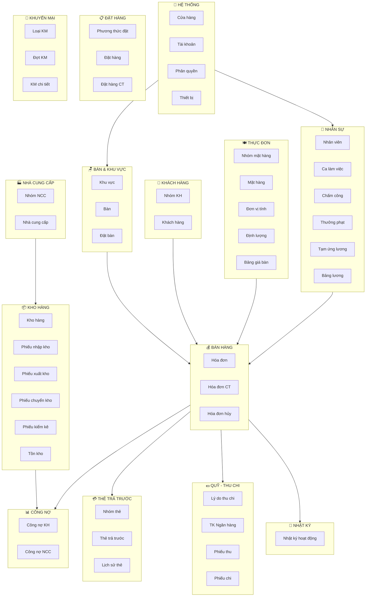
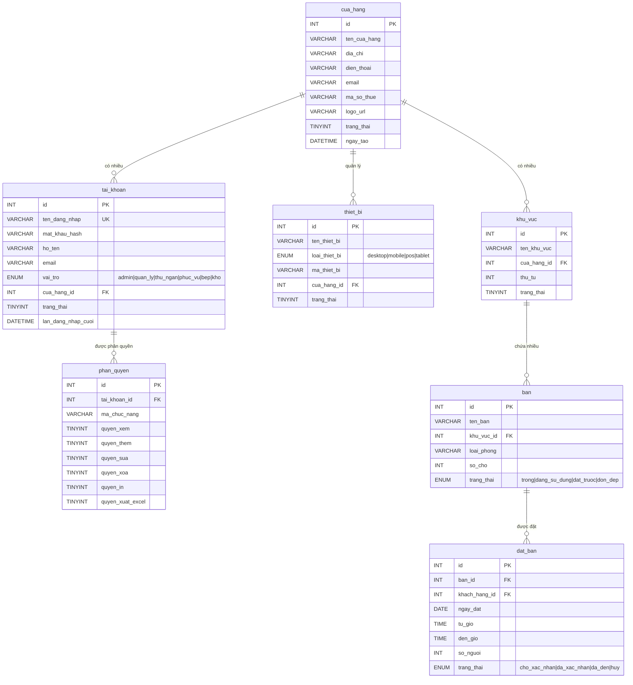
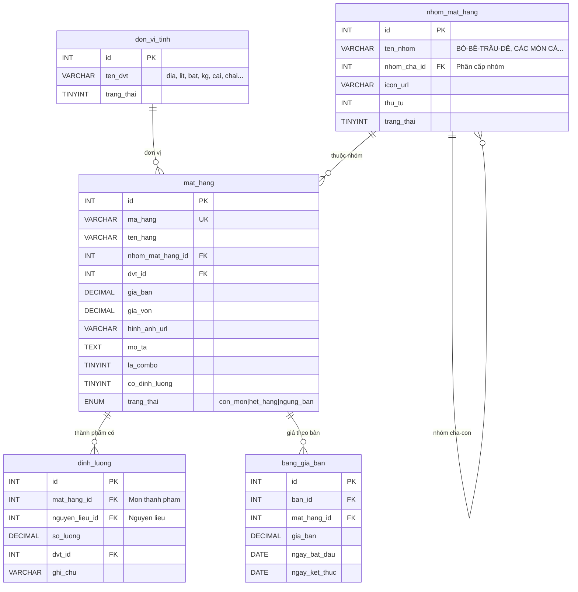
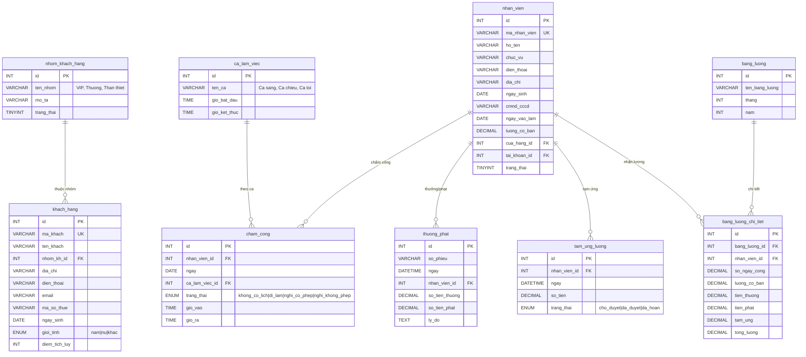
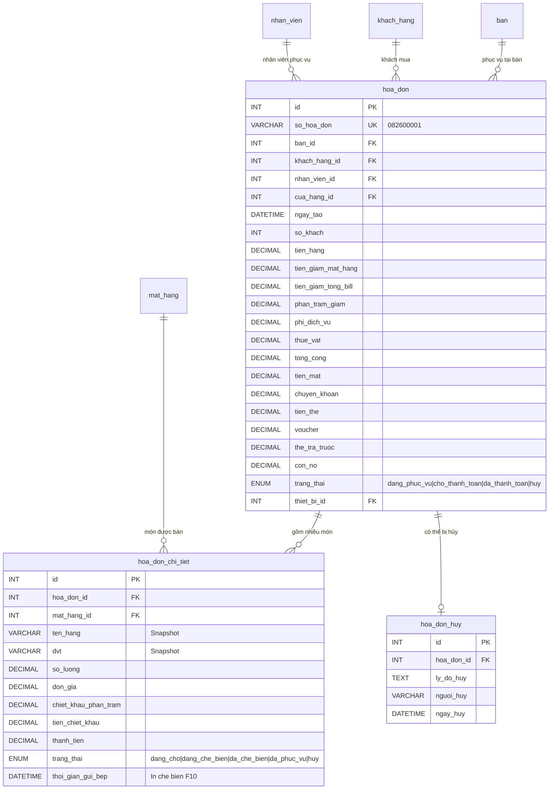
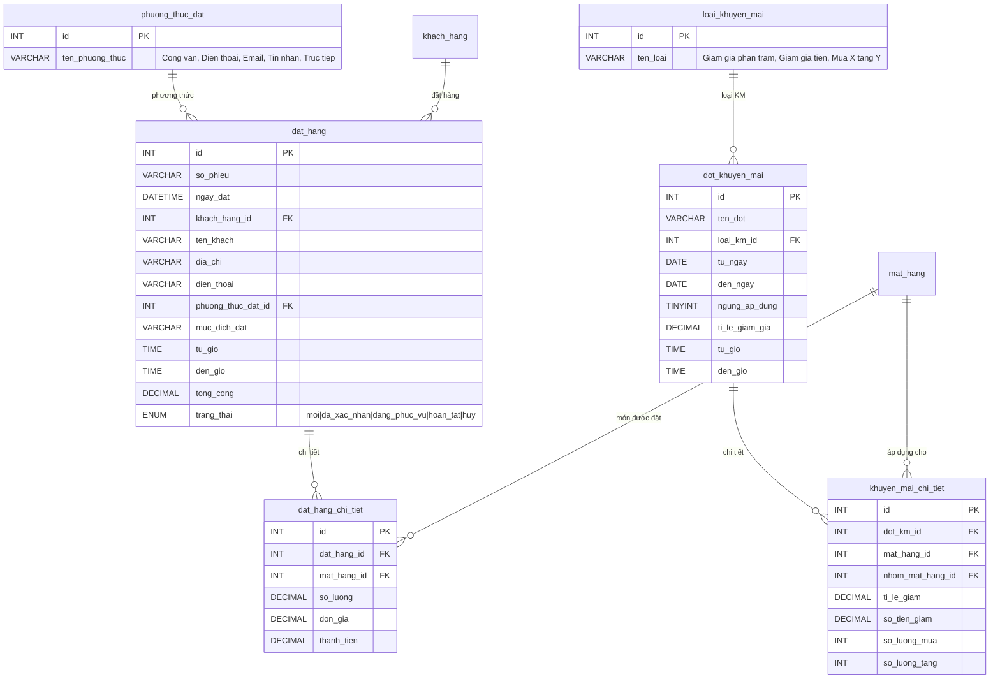
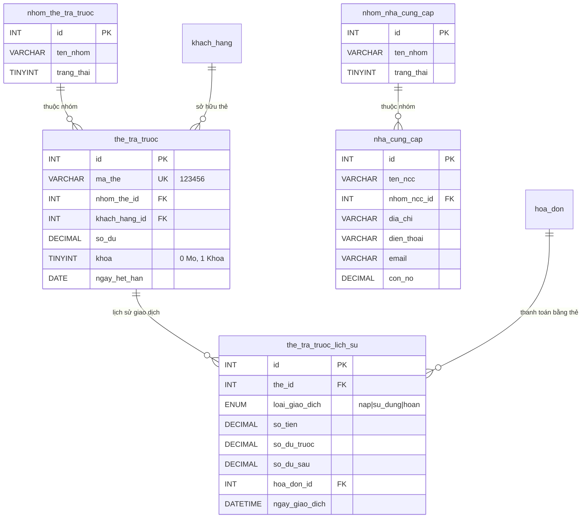
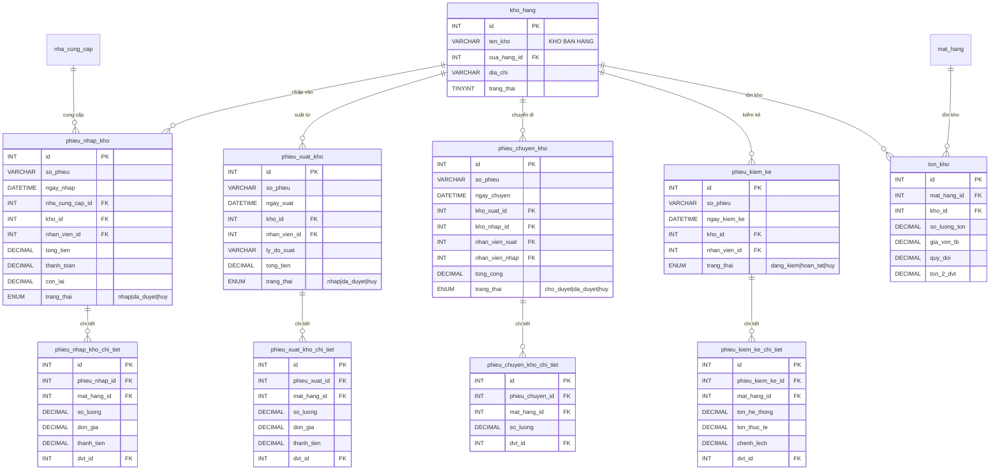
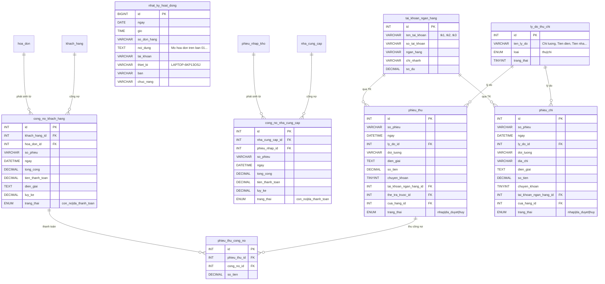

# Sơ đồ ERD - Database Quản lý Bar, Nhà hàng

## Sơ đồ tổng quan các phân hệ

---

## ERD chi tiết - Phân hệ Hệ thống & Bàn

---

## ERD chi tiết - Phân hệ Thực đơn & Mặt hàng

---

## ERD chi tiết - Phân hệ Khách hàng & Nhân sự

---

## ERD chi tiết - Phân hệ Hóa đơn & Bán hàng

---

## ERD chi tiết - Phân hệ Đặt hàng & Khuyến mại

---

## ERD chi tiết - Phân hệ Thẻ trả trước & Nhà cung cấp

---

## ERD chi tiết - Phân hệ Kho hàng

---

## ERD chi tiết - Phân hệ Công nợ & Quỹ Thu chi

---

## Tổng kết

| Thống kê | Số lượng |
|----------|----------|
| **Tổng số bảng** | 42 |
| **Views báo cáo** | 4 |
| **Phân hệ** | 15 |
| **Foreign Keys** | 60+ |
| **Indexes** | 15+ |

> [!TIP]
> File SQL đầy đủ: [quanlybar_database.sql](file:///d:/QuanLyBar/database/quanlybar_database.sql)
